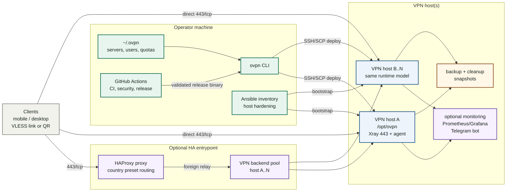

# ovpn

[](https://github.com/agentram/ovpn/actions/workflows/ci.yml)
[](https://github.com/agentram/ovpn/actions/workflows/security.yml)
[](https://github.com/agentram/ovpn/actions/workflows/release.yml)

`ovpn` operates self-hosted Xray (`VLESS + REALITY`) VPN servers from a local Go CLI over SSH.

The CLI keeps server and user state in `~/.ovpn`, renders Docker Compose runtime files, and pushes them to Linux hosts. Optional HAProxy support can route traffic to a VPN backend pool.

It is intended for operators who prefer a local CLI and SSH workflow over a web panel. It is not a hosted VPN service; it gives you reproducible files and commands for your own servers.

## Fast navigation

- [Project site](https://agentram.github.io/ovpn/)
- [X / updates](https://x.com/OVPN_project)
- [Architecture](#architecture)
- [Design points](#design-points)
- [Security and quota defaults](#security-and-quota-defaults)
- [Quick start](#quick-start)
- [Production flow](#production-flow)
- [HA proxy rollout](#4a-optional-ha-proxy-rollout)
- [User operations](#6-add-users-and-deliver-links)
- [CLI guide](docs/cli.md)
- [Transport profiles](docs/transports.md)
- [Monitoring](#7-optional-monitoring)
- [Documentation map](#documentation-map)

## Production model

- Ansible prepares the host baseline: packages, Docker, SSH, firewall, unattended upgrades, and hardening.
- `ovpn` owns the VPN runtime: Xray config, users, quotas, monitoring, backups, and cleanup.
- Desired state stays local under `~/.ovpn`; deploys render runtime files and push them over SSH/SCP.
- Remote services run as Docker Compose under `/opt/ovpn`, which keeps maintenance and recovery predictable.
- Xray REALITY listens on `443/tcp`; internal agent and monitoring endpoints stay private by default.
- Real inventory, hostnames, IPs, tokens, and private keys stay outside the public repository.

## Architecture



## Design points

- Local state: `~/.ovpn` stores servers, users, quotas, and metadata used for rendering.
- SSH/SCP deploy path: commands render files locally and apply them through normal server access.
- Docker runtime: Xray, `ovpn-agent`, optional proxy, and monitoring run under `/opt/ovpn`.
- Multi-host user operations: user add/remove/enable/disable/quota commands apply to all enabled VPN servers by default.
- Transport profiles: keep the default TCP/REALITY baseline for compatibility and use opt-in fallback profiles for degraded networks; plain XHTTP is available when operators accept its lack of transport security, self-SNI TCP/TLS can serve a normal HTTPS fallback page on the same domain, and experimental VLESS Encryption + XHTTP is available for supported clients.
- Optional proxy role: HAProxy can front a backend pool and use country presets for split routing.
- Security defaults: Xray routing blocks BitTorrent and public tracker domains; Ansible can add host-level Tor exit filtering. The rendered Xray config (REALITY private key + client UUIDs) is stored `0640 root:<xray-gid>`, and `ovpn-agent` mutating endpoints require a bearer token (`OVPN_AGENT_TOKEN`, auto-provisioned on deploy).
- Maintenance commands: `doctor`, `status`, logs, backups, restore, cleanup, monitoring, and release checks are part of the CLI.

## Key features

- Local desired state in `~/.ovpn`
- Remote Docker Compose runtime in `/opt/ovpn`
- User lifecycle commands and VLESS link generation
- Global-by-default user provisioning across enabled servers
- Profile-aware VLESS link, QR, and export commands
- Optional self-SNI HTTPS camouflage profile with an internal static fallback site
- Rolling `30d` traffic quota enforcement
- Lightweight per-user connection diagnostics and short targeted debug windows (`basic` mode is on by default; see `docs/cli.md`)
- Optional Prometheus, Alertmanager, Grafana, and Telegram bot monitoring
- Optional HA proxy entrypoint with backend failover
- Backup, restore, and decommission commands

## Versioning

- Current pinned version: `1.9.0`
- Check locally: `./ovpn version`
- Release source of truth:
  - `VERSION`
  - top entry in `CHANGELOG.md`
- Runtime image defaults source of truth:
  - [`internal/defaults/images.go`](internal/defaults/images.go)
- Versioning policy:
  - major: breaking CLI, API, or operator workflow changes
  - minor: new commands, monitoring surfaces, or operator features
  - patch: fixes and small UX improvements

## Community

- X / updates: https://x.com/OVPN_project
- Issues: confirmed bugs and concrete feature requests
- Discussions: questions, usage help, design ideas, and announcements
- Security: use private vulnerability reporting, not public issues

## Requirements

- Release binary, or Go `1.26.2+` when building from source
- SSH key access to the target host
- Target host running Debian `12+` or Ubuntu `22.04+`
- Clean Linux host recommended
- Root SSH access is the simplest supported setup
- Docker/Compose on the host, usually installed by the Ansible bootstrap

## Security and quota defaults

- Default security profile: `OVPN_SECURITY_PROFILE=minimal`
- Minimal profile blocks BitTorrent protocol traffic and public tracker domains in Xray routing.
- Threat DNS defaults to `9.9.9.9,149.112.112.112`.
- If the selected Xray image cannot validate geosite resources, temporarily roll back with:

```bash
export OVPN_SECURITY_PROFILE=off
./ovpn deploy <server>
```

- Default quota: rolling `30d`, `300 GB` per user when no per-user limit is set.
- Optional host-level Tor exit-node blocking exists in Ansible and is off by default.
- Ansible tunes host conntrack for VPN/NAT workloads and monitoring alerts on missing/high/critical conntrack usage.

See [`docs/security.md`](docs/security.md) for the full security model.
See [`docs/transports.md`](docs/transports.md) for profile rollout, including the optional self-SNI HTTPS fallback profile.

For experimental VLESS Encryption + XHTTP, allow `13180/tcp` in the target host's Ansible inventory, apply `playbooks/host-maintenance.yml`, then enable `vless-xhttp-vlessenc`, deploy, and generate a profile-specific link. The first enable uses the target server's pinned Xray image over SSH, so Docker is not required on the operator workstation. The profile is currently confirmed with Mihomo only; see [`docs/transports.md`](docs/transports.md) before sending it to users.

## Optional camouflage

`vless-tcp-tls-selfsni-web` is off by default. It uses a real certificate for the VPN domain, keeps Xray as the public `443/tcp` listener, and sends ordinary HTTPS traffic to an internal static site.
Keep `ovpn_camouflage_cert_email` set in production so certificate expiry and renewal failures can reach an operator.

```yaml
# 1. Enable the Ansible prerequisites in host_vars/<server-hostname>.yml.
# Do this before switching the server profile.
ovpn_camouflage_enabled: true
ovpn_camouflage_domain: vpn.example.net
ovpn_camouflage_cert_email: ops@example.net
```

```bash
cd ansible
ANSIBLE_CONFIG=ansible.cfg ansible-playbook -i inventories/production/hosts.yml playbooks/security.yml --limit vpn.example.net
cd ..

# 2. Switch the 443/tcp profile and deploy.
./ovpn server profile switch <server> vless-tcp-tls-selfsni-web
./ovpn deploy <server>
./ovpn doctor <server>
curl -vk https://vpn.example.net/
```

Users need new links only if they switch to this profile. See [`docs/security.md`](docs/security.md) for certificate and firewall details.

## Capacity defaults

- Remote server backups: keep latest `7`
- Local backups: keep latest `7`
- Remote pre-deploy snapshots: keep latest `7`
- Monitoring defaults are sized for small hosts:
  - Prometheus scrape/evaluation interval: `60s`
  - Prometheus retention: `10d` with a `512MB` size cap
  - Prometheus WAL compression: enabled
  - cAdvisor housekeeping: `60s` (max `5m`)
  - Critical host memory guard: `MemAvailable < 64MiB` for `2m`
  - Container OOM events: alerted from cAdvisor
  - Grafana background reporting and update checks: disabled
  - Memory and transient collector warnings use longer windows before firing, but still send resolved Telegram notifications.

## Quick start

Use this flow for a first small server. Replace placeholders with your own values.

```bash
# Use the release archive for your workstation OS/arch, or build from source for development.
# Release archives contain one executable: ovpn.
# Source build:
# go build -o ovpn ./cmd/ovpn
./ovpn version

./ovpn server add \
  --name <server> \
  --host <server-ip> \
  --domain <domain> \
  --ssh-user root \
  --ssh-port 22 \
  --xray-version 26.7.28

./ovpn server init <server>
./ovpn doctor <server>
./ovpn user add --username <user>
./ovpn user link --server <server> --username <user>
```

`user link` prints the client link and a terminal QR code by default for mobile onboarding. Use `--qr=false` when you need link-only output for scripts.
New REALITY/TLS links default to `fp=firefox`; use `--fingerprint` or `--spider-x` only when you need an explicit client-link variant.
See [`docs/transports.md`](docs/transports.md) before enabling fallback profiles or switching the default generated link profile.

`server init` performs the first bootstrap/deploy for the VPN runtime. Use `deploy` later when you change runtime settings:

```bash
./ovpn deploy <server>
```

## Production flow

Recommended order:

1. Prepare the host with Ansible.
2. Register the server in local `ovpn` state.
3. Initialize and validate the runtime.
4. Add users and share client links.
5. Enable monitoring if you need it.
6. Back up before risky changes.

### 1. Pre-flight checks

Before changing a host, confirm SSH, listening ports, and Docker state:

```bash
ssh root@<server-ip> 'hostnamectl'
ssh root@<server-ip> 'sudo ss -lntup'
ssh root@<server-ip> 'sudo docker ps --format "table {{.Names}}\t{{.Status}}\t{{.Ports}}"'
```

### 2. Host bootstrap with Ansible

Start from the example inventory and keep your real inventory private.

```bash
cd ansible
mkdir -p inventories/production
cp -R inventories/example/. inventories/production/
```

Edit `inventories/production/hosts.yml`, then validate and apply:

```bash
ANSIBLE_CONFIG=ansible.cfg ansible-playbook -i inventories/production/hosts.yml playbooks/bootstrap.yml --syntax-check
ANSIBLE_CONFIG=ansible.cfg ansible-playbook -i inventories/production/hosts.yml playbooks/bootstrap.yml --limit <host> --check --diff
ANSIBLE_CONFIG=ansible.cfg ansible-playbook -i inventories/production/hosts.yml playbooks/bootstrap.yml --limit <host>
```

For already deployed hosts, use the maintenance playbook instead:

```bash
ANSIBLE_CONFIG=ansible.cfg ansible-playbook -i inventories/production/hosts.yml playbooks/host-maintenance.yml --limit <host> --check --diff
ANSIBLE_CONFIG=ansible.cfg ansible-playbook -i inventories/production/hosts.yml playbooks/host-maintenance.yml --limit <host>
```

See [`README.ansible.md`](README.ansible.md) for inventory and hardening details.

### 3. Register server in local state

```bash
./ovpn server add \
  --name <server> \
  --host <server-ip> \
  --domain <domain> \
  --ssh-user root \
  --ssh-port 22 \
  --xray-version 26.7.28
```

### 4. Initialize and deploy runtime

```bash
./ovpn server init <server>
./ovpn doctor <server>
./ovpn server status <server>
```

Use `deploy` after config or code changes:

```bash
./ovpn deploy <server>
./ovpn doctor <server>
```

Official release binaries embed the Linux `ovpn-agent` and `ovpn-telegram-bot` runtime binaries used by deploys, so release archives contain only the `ovpn` executable. Normal installed usage does not require Go, a source checkout, or keeping sidecar binaries in the same directory. Use `OVPN_REPO_ROOT` only for development builds without embedded runtime assets, or when you intentionally deploy an unsupported runtime architecture through source fallback:

```bash
export OVPN_REPO_ROOT=/absolute/path/to/ovpn
ovpn deploy <server>
```

### 4a. Optional HA proxy rollout

Use a proxy only when you want one entrypoint in front of existing VPN backends.
Available proxy presets are `ru` and `cn` (`china` is accepted as an alias for `cn`).

```bash
./ovpn server add \
  --name <proxy> \
  --role proxy \
  --proxy-preset ru \
  --host <proxy-ip> \
  --domain <proxy-domain> \
  --ssh-user root \
  --ssh-port 22

./ovpn server backend attach --proxy <proxy> --backend <vpn-backend>
./ovpn deploy <vpn-backend>
./ovpn server init <proxy>
./ovpn config validate --server <proxy>
./ovpn deploy <proxy>
./ovpn doctor <proxy>
```

Attach and deploy the backend before initializing the proxy.
The proxy render requires at least one backend, and the backend deploy makes the relay identity live before proxy traffic arrives.

See [`docs/ha.md`](docs/ha.md) for the full HA design and troubleshooting guide.

### 5. Validate runtime

```bash
./ovpn doctor <server>
./ovpn server status <server>
./ovpn server logs <server> --service xray --tail 200
./ovpn server logs <server> --service ovpn-agent --tail 200
```

### 6. Add users and deliver links

```bash
./ovpn user add --username <user>
./ovpn user add --username <user> --expiry 2026-05-01
./ovpn user quota-set --username <user> --monthly-gb 400
./ovpn user quota-set --username <user> --monthly-bytes <bytes>
./ovpn user enable --username <user>
./ovpn user rm --username <user>

./ovpn user link --server <server> --username <user>
./ovpn user link --server <server> --username <user> --qr=false
./ovpn user link --server <server> --username <user> --qr-file ~/Desktop/<user>.png
./ovpn user show --server <server> --username <user>
./ovpn user list --server <server>
```

Mutating user commands apply to all enabled servers by default. Link and read commands stay server-scoped. QR output is enabled by default and contains the same full client credential as the `vless://` link; treat saved QR files as secrets.

Use `--monthly-gb` for human-sized quota changes. `ovpn` stores quota internally as bytes; `--monthly-gb 400` means `400 * 1024^3` bytes. `--monthly-bytes` remains available for exact automation.

When `--email` is omitted, new users get stable identity `username@global`. User expiry is cluster-wide and uses UTC end-of-day semantics.

For per-user support, start with:

```bash
./ovpn user diagnose --server <server> --username <user> --since 24h
./ovpn user debug start --server <server> --username <user> --duration 15m
./ovpn user debug list --server <server>
./ovpn user debug show --server <server> --username <user> --since 15m
./ovpn user debug stop --server <server> --username <user>
```

See [`docs/cli.md`](docs/cli.md) for the full CLI command map and targeted debug workflow.

### 7. Optional monitoring

Start monitoring:

```bash
./ovpn deploy <server>
./ovpn server monitor up <server>
./ovpn server monitor status <server>
```

Telegram setup can be done in one command:

```bash
OVPN_TELEGRAM_BOT_TOKEN=<token> \
./ovpn server monitor telegram-setup <server> \
  --owner-user-id <your-numeric-user-id>
```

- Get `<token>` from [@BotFather](https://t.me/BotFather) → `/newbot` (one bot per server).
- Get `<your-numeric-user-id>` by sending any message to [@RawDataBot](https://t.me/RawDataBot) — your ID is `message.from.id` in the reply.

The Telegram bot is read-only by default. Owner-only recovery actions require `OVPN_TELEGRAM_ADMIN_TOKEN`.

See [`docs/monitoring.md`](docs/monitoring.md) for full setup instructions, dashboards, alerts, and Telegram behavior.

### 8. Backups

```bash
./ovpn server backup <server>
ls -lah ~/.ovpn/backups
```

### 9. Decommission old runtime

Preview first:

```bash
./ovpn --dry-run server cleanup <server>
```

Then run cleanup with explicit confirmation:

```bash
./ovpn server cleanup <server> --confirm CLEANUP
```

By default, cleanup removes remote runtime files and disables local server metadata. Add `--remove-local` only when you also want to remove local metadata.

## Minimal operational commands

```bash
./ovpn version
./ovpn deploy <server>
./ovpn restart <server>
./ovpn doctor <server>
./ovpn server status <server>
./ovpn server logs <server> --service xray --tail 200
./ovpn stats --server <server>
./ovpn user list --server <server>
./ovpn user add --username <user>
./ovpn user quota-set --username <user> --monthly-gb 400
./ovpn user link --server <server> --username <user>
./ovpn server monitor up <server>
./ovpn server backup <server>
./ovpn server restore <server> --remote-path /opt/ovpn-backups/<archive>.tgz
./ovpn server cleanup <server> --confirm CLEANUP
```

## VPN clients

End-user setup instructions cover iOS, Android, Windows, and macOS:

- [`docs/clients.md`](docs/clients.md): English
- [`docs/clients-ru.md`](docs/clients-ru.md): Russian

Generate the optional PDF guides locally when you need them for Telegram `/guide`:

```bash
make docs-pdf
```

## Documentation map

- [`README.md`](README.md): main operator entrypoint
- [`README.ansible.md`](README.ansible.md): host bootstrap and hardening
- [`DEVELOPMENT.md`](DEVELOPMENT.md): contributor and architecture guide
- [`docs/cli.md`](docs/cli.md): CLI command map and practical operator workflows
- [`docs/transports.md`](docs/transports.md): transport profiles, fallback links, and rollout notes
- [`docs/clients.md`](docs/clients.md): English client guide
- [`docs/clients-ru.md`](docs/clients-ru.md): Russian client guide
- [`docs/security.md`](docs/security.md): security and hardening model
- [`docs/ha.md`](docs/ha.md): HA proxy topology and rollout
- [`docs/monitoring.md`](docs/monitoring.md): monitoring operations
- [`docs/ci.md`](docs/ci.md): GitHub Actions workflows
- [`docs/testing.md`](docs/testing.md): testing strategy
- [`docs/upgrades.md`](docs/upgrades.md): upgrades, rollback, and cleanup

## Release process

1. Update `VERSION`.
2. Prepend the matching version entry to `CHANGELOG.md`.
3. Merge to `main`.
4. GitHub Actions validates both files, creates the semver tag if needed, and publishes the release.

## Protected main

Recommended required checks:

- `Go Quality`
- `Ansible Quality`
- `Gitleaks Tree Scan`
- `Trivy FS Scan`

Release tags matching `*.*.*` should be protected from update and deletion.

## Support

This repository includes an optional sponsor button and public donation page:

- X / updates: `https://x.com/OVPN_project`
- sponsor button config: [`.github/FUNDING.yml`](.github/FUNDING.yml)
- donation page source: [`docs/donate/index.html`](docs/donate/index.html)
- project page URL: `https://agentram.github.io/ovpn/donate/`

## License

This repository is source-available under the `Attribution-NonCommercial Source License 1.0 (ovpn)`.
You may use, modify, and share it for non-commercial purposes with attribution. Commercial use requires separate permission.
